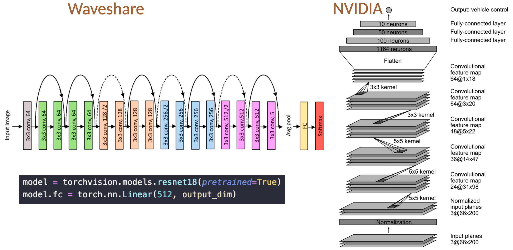

 
 # Autonomous driving car JetRacer NVIDIA (supervised learning + object detection)
 
 ## Two approaches were implemented within the framework of this project:

 1. **Waveshare** approach: 
 
 ”... put the mobile robot on the track ... control the car to run along the track, every time you move a small position, use the mouse to move to the ideal running path of the car in the picture and click to save the picture ...”

 2. **NVIDIA** approach based on paper "End to End Learning for Self-Driving Cars":

 ”…We trained a convolutional neural network (CNN) to map raw pixels from a single front-facing camera directly to steering commands. This end-to-end approach proved surprisingly powerful …”

### Difference:

#### Data collection.


1. **Waveshare**: Human clicks an “ideal path” on each image; label derived from that.

2. **NVIDIA**: Human drives normally; label is the steering command synchronized with camera.
 
#### Model 
 


1. In the **Waveshare** is uses ResNet-18 from TorchVision (a standard image classification CNN) that was originally trained on a huge dataset (ImageNet), reused as a feature extractor and then adapted for regression. Was kept the convolutional backbone and only replaced the last layer so the network outputs driving-related regression values (e.g., the target point x/y).

2. **NVIDIA’s** DAVE-2 is a custom CNN that takes a normalized 66×200 YUV image and outputs a steering command represented as inverse turning radius. The network is 9 layers: normalization + 5 conv layers (early strided 5×5 for downsampling, later 3×3 for refinement) followed by 3 FC layers (100→50→10) and a final output.

### Implementation.


I followed **NVIDIA** approach. So I gathered data by driving car on the map using gamepad.

Architecturally, this is a DAVE-2 style network: same conv stack (5×5 stride-2 then 3×3) and same FC head (100–50–10). I modernized it with BatchNorm and Dropout and adapted the output to 2 regression values for steering/throttle.

My network is split into two parts:
1. Convolutional feature extractor (self.conv)Takes the image and learns visual features like edges, lane boundaries, texture, track borders.
Fully-connected head (self.fc)Takes the extracted features and outputs 2 continuous values (steering/throttle).
What conv does:
5×5 filters scan the image to detect low-level patterns (edges, contrast boundaries).
stride=2 downsamples (roughly halves resolution), making the network faster and forcing it to learn larger-scale structure.
BatchNorm stabilizes training (keeps activations well-scaled).
ReLU adds non-linearity so it can learn complex patterns.
Conv block 4. What it does:
3×3 is used when you’re already at a lower resolution: it refines features without further downsampling.
Expands to 64 channels (richer feature representation).

Fully-connected:
nn.Linear(64 * 1 * 18, 100)

Flatten convolutional output into 1D vector (So each image becomes a 1152-dimensional feature vector).
100 neurons - learn deep relationships in extracted features.
The FC head turns those 1152 features into your final control outputs (steering/throttle).


## Oject detection (YOLO 5)


 
 ## Files and commands overview:
 
 ### Collect the data:

 1. data_collection.py

 ```python3 data_collection.py --data-root ./data --session-name turn_light --save-interval 0.5```

 2. label_from_photos.py

 ```python3 label_from_photos.py --session ./data/turn_more2 --k 0.9 --deadzone 0.07 --steering-limit 0.9 --throttle 0.2```
 
 ### train the model:

 train_control_cnn.py

```python3 train_control_cnn.py --train-dirs ./data/full_manual ./data/full_manual_dark ./data/full_manual_big ./data/straight ./data/curves ./data/curves_main ./data/wave_full ./data/half_manual ./data/turn ./data/turn_more2 ./data/turn_light --val-dirs ./data/full_path ./data/turn_more --out-dir ./models --aug-strength 0.1 --dropout 0.2 --patience 20```


### autonomous driving:

drive_autonomous.py

```python3 drive_autonomous.py```

### autonomous driving with object detection (YOLOv5):

drive_autonomous_yolo.py

```python3 drive_autonomous_yolo.py```

### evaluation model performance

eval_model.py

```python3 eval_model.py```

### testing motors' steering:

test.py

```python3 test.py```


### training YOLO5:

yolov5 -> train.py

cd yolov5

```
python train.py \
  --img 416 \
  --batch 16 \
  --epochs 150 \
  --data ../Autonomous-Systems/supervised_learning/datasets/od/data.yaml \
  --weights yolov5n.pt \
  --name od_yolov5n
  ```

